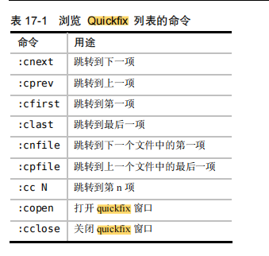

# VIM notes

## 解决远程使用vim粘贴时出现行首多次缩进的问题

[参考](http://www.cnblogs.com/end/archive/2012/06/01/2531142.html)

粘贴前
    :set paste
粘贴后
    :set nopaste

```sh

# vim查找
:vimgrep
:vim[!] /pattern/[g][j] file1 file2...

g - 每处匹配还是每行匹配，有g就是每处匹配一条记录
j - 是否自动跳转到第一处，有j就不跳，只更新quickfix列表
! - 只更新quickfix列表，不跳到第一处
* - 某目录的任意文件
** - 目录及子目录的任意文件

位置列表：每个窗口一个，可以有多个，相应quickfix列表前面加l，入:lmake,:lgrep等

```


