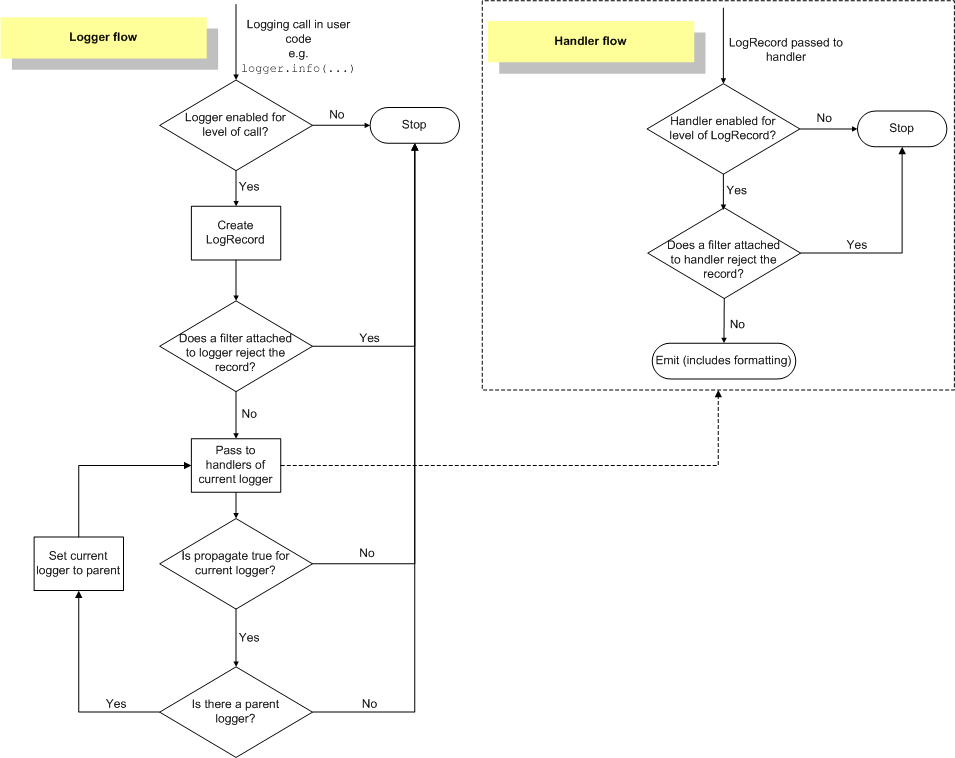

# logging

## 调用逻辑

出自[官网](https://docs.python.org/3/howto/logging.html#logging-advanced-tutorial)

为什么有些第三方库的调试日志写死用自定义的logger，而有些则允许传入指定的logger？

比如，flask用的是自定义的logger，而apscheduler则支持logger

我个人的思考是，作为一个服务框架，应当支持传入自定义的logger，因为使用时作为一个服务持续运行，需要持续监控其中的工作环节，而其他的工具类库，一般只有工具开发过程中的测试、调试阶段会用到日志，应用在使用的时候很少需要内部的日志细节。

像gunicorn这样的库没有提供完善的日志库的注入方法，只能根据它的名字拿到它内部的logger。
